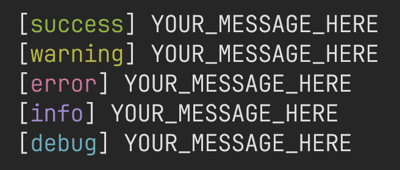

This is a collection of my commonly used functions that I figured nice to have in a library.<br>
Get started by importing the package:
```python
import justsdk
```


## Colored Print
*_from [`color_print.py`](./src/justsdk/color_print.py)_

Print colored messages to the console with optional timestamps.<br>
Simple as that, expected output: `[MESSAGE_TYPE] YOUR_MESSAGE_HERE`



### Convenience Functions

- Most of the time, you would only use the convenience functions:

  ```python
  justsdk.print_success(
      message="YOUR_MESSAGE_HERE",
      newline_before=False,  # Add a newline before [MESSAGE_TYPE]
      newline_after=False,   # Add a newline after [MESSAGE_TYPE]
      file=None,             # Print to a specific file (default: sys.stdout)
      show_timestamp=False
  )
  ```

- Available functions:
  - `print_success()` — Green
  - `print_warning()` — Yellow
  - `print_error()` — Red
  - `print_info()` — Magenta
  - `print_debug()` — Cyan

### Initiating `ColorPrinter` Object

- Else, you can have more control by initiating an instance:

  ```python
  from justsdk import ColorPrinter


  printer = ColorPrinter(
      file=None,
      use_color=True,
      show_timestamp=False,  # Show timestamp in each message (based on your timezone)
      quiet=False
  )
  printer.success("YOUR_MESSAGE_HERE")
  ```
